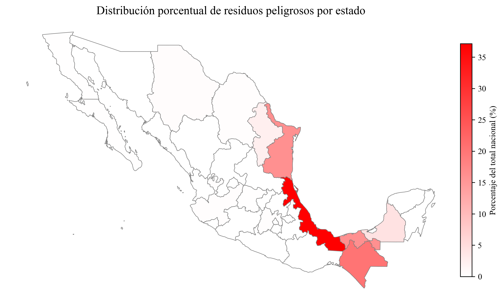
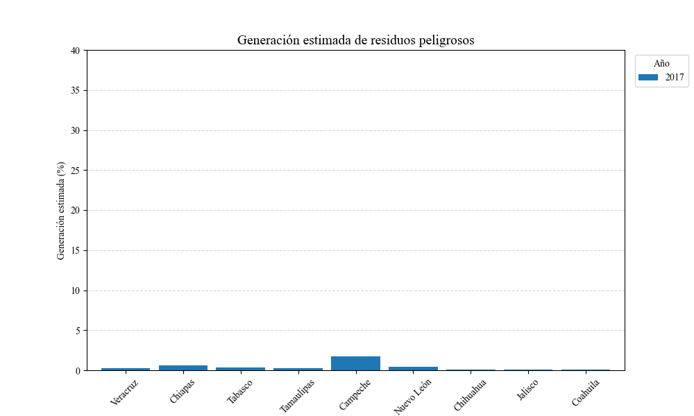

# Generación Estimada de Residuos Peligrosos en México (2017–2023)

Este repositorio contiene un análisis exploratorio y visualización de datos sobre la generación de residuos peligrosos en México, a partir de fuentes oficiales de datos abiertos.

## Objetivo

Comprender la **distribución geográfica** y **temporal** de los residuos peligrosos generados en el país, con especial énfasis en su relación con la **infraestructura energética e industrial**, como refinerías de PEMEX.

## 📁 Contenido del repositorio

- `residuos_peligrosos_analisis.ipynb`: Notebook con el análisis completo (limpieza, normalización, visualización)
- `df_limpio.csv`: Dataset limpio con columnas estandarizadas
- `imagenes/`: Gráficas y mapas generados para análisis
- `README.md`: Este documento

## Proceso de limpieza

- Aplicación de funciones de **normalización de texto** (`lowercase`, sin tildes, sin comas)
- Creación de **diccionario de mapeo** semántico para unificar más de 300 descripciones distintas
- Separación en variables clave: `estado`, `tipo_residuo`, `categoria_residuo`, `año`

## 📈 Visualizaciones

### Distribución porcentual de residuos por estado

### Generación estimada por año y estado

## Contexto energético

Los estados con mayor generación de residuos coinciden con:
- **Refinerías activas y rehabilitadas** en Minatitlán (Veracruz), Dos Bocas (Tabasco), Salina Cruz (Oaxaca), Salamanca (Gto.), entre otras.
- **Concentración de industria petroquímica y portuaria**
  
Veracruz, por ejemplo, representa **más del 35%** del total nacional.

## 📊 Tipos de residuos más comunes

- Aceites usados y dieléctricos
- Lodos contaminados con hidrocarburos
- Solventes gastados, tierras impregnadas
- Envases contaminados y sólidos con metales pesados

## 💡 Conclusiones

> La energía que impulsa a México también genera retos ambientales.
> y necesitamos datos, tecnología y conciencia para gestionarlos.

Este análisis busca contribuir al **monitoreo ambiental**, la **formulación de políticas públicas** y la toma de decisiones basadas en datos.

---

## 📚 Fuente de datos

- Plataforma de Datos Abiertos:  
  [datos.gob.mx](https://www.datos.gob.mx/dataset/generacion_estimada_residuos_peligrosos_tipo_residuo)

## 🧠 Autor

Edwin Azahel Aguilar Martínez  
*Ingeniería en Energías Renovables* | *Análisis Energeticos*  
📍 México

